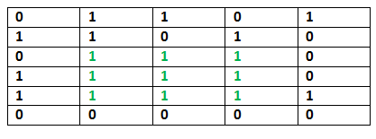

# Matrices

Given a binary matrix, find out the maximum size square sub-matrix with all 1s.



Let the given binary matrix be `M[R][C]`. The idea of the algorithm is
to construct an auxiliary size matrix `S[][]` in which each entry
`S[i][j]` represents size of the square sub-matrix with all 1s including
`M[i][j]` where `M[i][j]` is the rightmost and bottommost entry in
sub-matrix.

```
Input: [

[0, 1, 1, 0, 1],

[1, 1, 0, 1, 0],

[0, 1, 1, 1, 0],

[1, 1, 1, 1, 0],

[1, 1, 1, 1, 1],

[0, 0, 0, 0, 0],

]

Output: 9
```